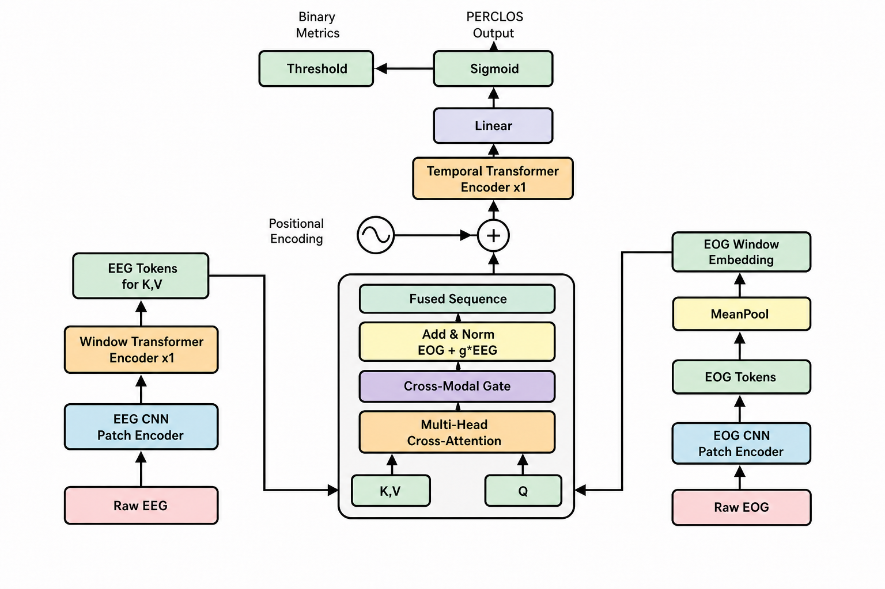
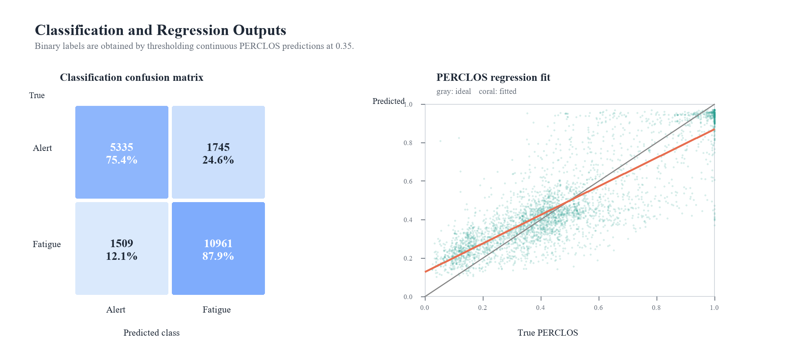

# EyeQueryNet：基于眼电查询的原始脑电--眼电门控时序 Transformer 驾驶疲劳检测方法

**EyeQueryNet: EOG-Query Gated Temporal Transformer for Raw EEG-EOG Driver Fatigue Detection**

作者姓名待补充  
单位待补充

## 摘要

驾驶疲劳检测是智能交通安全中的重要任务。脑电（EEG）能够反映驾驶员神经活动状态，眼电（EOG）能够捕获眨眼、闭眼和眼球运动等疲劳相关行为。SEED-VIG 数据集的连续 PERCLOS 标签由眼动测量得到，因此 EOG-only 在该数据集上是强基线。针对这一特点，本文提出一种基于眼电查询的原始 EEG/EOG 门控时序 Transformer，命名为 EyeQueryNet。模型首先用轻量 CNN 从原始 EEG 和 EOG 中提取窗口级 token；随后以 EOG 窗口表征作为 Query，以 EEG token 作为 Key/Value，使眼动疲劳线索检索 EEG 中的补充表征；再通过跨模态 gate 控制 EEG 信息注入强度；最后使用 temporal Transformer 对连续窗口表示进行时序聚合。本文以连续 PERCLOS 回归为训练目标，二分类疲劳指标由同一回归输出阈值化得到。在按被试分组的五折跨被试验证中，EyeQueryNet 达到 Acc 0.8367、Macro-F1 0.8165、Balanced Accuracy 0.8104、RMSE 0.1423 和 Pearson 0.8454。实验结果表明，EOG-query 融合方向优于 EEG-query 和双向融合；加入 gate 后，相比无门控 EOG-query 版本进一步提升分类指标并降低 RMSE。

**关键词：** 驾驶疲劳检测；脑电；眼电；PERCLOS；跨模态注意力；门控融合；跨被试评估

## Abstract

Driver fatigue detection is important for intelligent transportation safety. Electroencephalography (EEG) reflects neural activity, whereas electrooculography (EOG) captures fatigue-related ocular behavior such as blinking, eyelid closure, and eye movements. In SEED-VIG, continuous PERCLOS labels are derived from eye-tracking measurements; therefore, EOG-only is a strong baseline. This paper proposes an EOG-query raw EEG-EOG gated temporal Transformer, named EyeQueryNet. The model extracts window-level tokens from raw EEG and EOG, uses the EOG window representation as the Query and EEG tokens as Key/Value, injects the retrieved EEG representation through a cross-modal gate, and applies a temporal Transformer to aggregate consecutive window representations. The model is trained for continuous PERCLOS regression, and binary fatigue metrics are obtained by thresholding the same regression output. Under subject-wise grouped five-fold validation, EyeQueryNet achieves Acc 0.8367, Macro-F1 0.8165, Balanced Accuracy 0.8104, RMSE 0.1423, and Pearson 0.8454. The results show that EOG-query fusion outperforms EEG-query and bidirectional variants, and that the gate improves classification metrics and RMSE over the no-gate EOG-query version.

**Keywords:** driver fatigue detection; EEG; EOG; PERCLOS; cross-modal attention; gated fusion; cross-subject evaluation

# I. 引言

## A. 研究背景

驾驶疲劳会降低驾驶员注意力、反应速度和风险感知能力，是交通事故的重要诱因。PERCLOS（percentage of eyelid closure）是疲劳驾驶研究中常用的眼动指标之一，能够从眼睑闭合状态刻画警觉度变化 [1]。与摄像头或车辆行为特征相比，生理信号能够更直接地反映驾驶员内部状态。EEG 记录神经活动，EOG 记录眼动和眼睑变化，两者在疲劳检测中具有互补价值。

SEED-VIG 是驾驶警觉度估计领域常用公开数据集之一。该数据集同步采集 EEG、EOG 和眼动信息，并提供由眼动测量计算得到的连续 PERCLOS 标签 [2], [3]。这一标签来源使 EOG 与标签天然接近，也解释了 EOG-only 模型在该数据集上的强表现。因此，本文不把“多模态全面超过 EOG-only”作为主要论断，而关注如何在强 EOG 代理基线上设计更合理的 EEG/EOG 融合方向。

## B. 现有问题

已有 EEG/EOG 驾驶疲劳方法多采用人工频带特征、传统分类器或直接拼接融合。特征工程方法依赖预设频带和手工统计量，直接拼接则容易忽略 EEG、EOG 与 PERCLOS 标签之间的不对称关系。若简单让 EEG 查询 EOG，模型可能把眼动信息当作附属证据；而在 SEED-VIG 中，标签本身来自眼动测量，EOG 更适合作为查询端去检索 EEG 中的补充信息。

## C. 本文方法与贡献

本文提出 EyeQueryNet，将 EOG 作为 Query、EEG 作为 Key/Value，并通过 gate 控制 EEG 信息注入强度。该设计将模型主线限定为“标签来源感知的跨模态融合”，使实验故事更清楚，也避免对强 EOG-only 基线作过度结论。本文贡献如下：

1. 提出一种面向原始 EEG/EOG 的 EOG-query 门控时序 Transformer，即 EyeQueryNet，减少人工特征依赖。
2. 根据 PERCLOS 标签来源设计 EOG-Q/EEG-KV 注意力方向，使眼动疲劳线索主动检索脑电补充表征。
3. 在按被试分组的五折验证中比较 EEG-only、EOG-only、传统参考基线和多种融合消融。
4. 明确区分连续 PERCLOS 回归与二分类疲劳检测：模型训练回归输出，分类指标由同一输出阈值化得到。

# II. 相关工作

## A. EEG/EOG 驾驶疲劳检测

Zheng 和 Lu 证明了 EEG 与 forehead EOG 对警觉度估计具有互补性，并在 SEED-VIG 上给出了多模态估计框架 [3]。后续研究进一步探索 EEG/EOG 多尺度结构、拓扑关系和模态解耦学习，例如 HMS-TENet [5] 和 VigilanceNet [6]。此外，也有研究从可扩展机器学习模型角度分析 EEG 驾驶疲劳检测性能 [7]。这些工作表明，多模态生理信号和跨被试评估是驾驶疲劳检测中的核心问题。

## B. 深度学习 EEG 分类

深度学习已广泛用于 EEG 表征学习。EEGNet 使用紧凑卷积结构实现跨范式 EEG 解码 [8]，Schirrmeister 等提出深浅层 CNN 并展示了 EEG 解码可视化能力 [9]。Transformer 和 Conformer 结构进一步增强了序列建模能力：Transformer 使用自注意力建模长程依赖 [11]，Conformer 将卷积与 Transformer 结合 [12]，EEG Conformer 则将卷积 Transformer 用于 EEG 解码和可视化 [10]。本文在卷积局部特征提取和 Transformer 注意力建模基础上，重点研究 EEG/EOG 的非对称跨模态融合方向。

## C. 跨被试学习与跨模态融合

跨被试评估比同被试随机划分更接近真实部署，因为不同被试的生理信号分布存在明显差异。领域适应方法如 Deep CORAL 通过对齐特征分布缓解跨域差异 [13]。在多模态 EEG/EOG 中，Zhang 和 Etemad 使用 capsule attention 学习模态间表示 [4]。本文不额外引入复杂域适应模块，而是在严格按被试分组的协议下，集中验证 EOG-query 方向和 gate 模块是否能带来更清楚的结构收益。

# III. 数据集与预处理

## A. 数据集介绍

实验使用 SEED-VIG 数据集 [2]。该数据集包含模拟驾驶任务中的 EEG、EOG 和眼动记录，并提供连续 PERCLOS 标签。本文使用原始 EEG 和 EOG 信号，其中 EEG 包含 17 个通道，采样率为 200 Hz；EOG 包含 7 个通道，采样率为 125 Hz。每个基础窗口长度为 8 秒，因此单窗口 EEG 输入含 1600 个采样点，EOG 输入含 1000 个采样点。

## B. 预处理

代码实现中将每个实验按 PERCLOS 标签窗口切分，并对每个通道在窗口内进行 z-score 标准化。模型输入由 8 个连续窗口组成，总时长约 64 秒。对于第 $t$ 个样本，模型接收 EEG 序列 $X^{eeg}\in\mathbb{R}^{8\times17\times1600}$ 和 EOG 序列 $X^{eog}\in\mathbb{R}^{8\times7\times1000}$，目标值为最后一个窗口对应的连续 PERCLOS。

## C. 实验协议

为避免同一被试样本同时出现在训练和测试中，本文采用按被试分组的五折跨被试验证。所有深度模型训练 20 个 epoch，batch size 为 4，优化器为 AdamW [14], [15]，学习率为 $10^{-3}$。本文报告两类评价结果。第一类是连续 PERCLOS 回归，使用 MAE、RMSE 和 Pearson 相关系数；第二类是二分类疲劳检测，将真实与预测 PERCLOS 按阈值 0.35 转换为清醒/疲劳标签，报告 Accuracy、Macro-F1 和 Balanced Accuracy。二者不是两个独立任务，而是同一连续输出的两种评价视角：回归指标反映警觉度估计精度，分类指标对应实际疲劳告警需求。

# IV. 本模型方法

## A. 整体架构

如图 1 所示，EyeQueryNet 包含四个主要模块：原始信号 patch encoder、EOG-query 跨模态注意力、跨模态 gate、temporal Transformer 与 PERCLOS 输出。EEG 分支提供窗口内 token，EOG 分支生成窗口级 query 和融合锚点。融合后的 8 个窗口表示输入 temporal Transformer，最终输出连续 PERCLOS；二分类结果由该输出阈值化得到。

{width=90%}

## B. 原始信号特征提取

EEG 和 EOG 分支均使用轻量 CNN patch encoder 提取局部时序特征。EEG 分支先得到窗口内 token 序列 $T^{eeg}_t$，再经过一层窗口 Transformer 建模局部 token 关系；EOG 分支得到 $T^{eog}_t$ 后进行平均池化，形成窗口级 EOG 表征 $e_t$：

$$
T^{eeg}_t=\mathrm{Transformer}(\mathrm{CNN}_{eeg}(X^{eeg}_t)),\quad
e_t=\mathrm{MeanPool}(\mathrm{CNN}_{eog}(X^{eog}_t)).
$$

## C. EOG-query 跨模态注意力

由于 PERCLOS 标签来自眼动测量，本文使用 EOG 表征作为 Query，使用 EEG token 作为 Key/Value：

$$
Q_t=e_tW_Q,\quad K_t=T^{eeg}_tW_K,\quad V_t=T^{eeg}_tW_V.
$$

跨模态注意力输出为：

$$
a_t=\mathrm{softmax}\left(\frac{Q_tK_t^\top}{\sqrt{d}}\right)V_t.
$$

该设计使眼动疲劳线索主动在 EEG token 中检索相关补充表征，而不是将两种模态简单拼接或完全对称处理。

## D. 门控融合与损失函数

注意力输出 $a_t$ 可能包含噪声或冗余信息，因此本文使用 gate 自适应控制 EEG 信息注入强度：

$$
g_t=\sigma\left(W_2\,\mathrm{GELU}(W_1[e_t;a_t])\right),
\quad
h_t=\mathrm{LayerNorm}(e_t+g_t\odot a_t).
$$

融合后的序列 $H=[h_1,\ldots,h_8]$ 加入位置编码后输入 temporal Transformer：

$$
S=\mathrm{Transformer}(H+P),\quad z=S_8.
$$

最终使用 Sigmoid 回归头输出 $\hat{y}\in[0,1]$：

$$
\hat{y}=\sigma(W_rz+b_r).
$$

训练时使用 Smooth L1 损失优化连续 PERCLOS。测试时，二分类标签由 $\hat{y}>0.35$ 得到。

**Algorithm 1. Training and inference procedure of EyeQueryNet**

| Stage | Operation |
|---|---|
| Input | Raw EEG/EOG windows, PERCLOS labels, threshold $\tau=0.35$ |
| Training | Split subjects into training, validation, and test sets for each fold. |
| Training | Extract EEG tokens and EOG window embeddings for each mini-batch. |
| Training | Use EOG embeddings as Query and EEG tokens as Key/Value. |
| Training | Apply cross-modal attention, gate, and temporal Transformer. |
| Training | Predict $\hat{y}$ and update parameters with Smooth L1 loss. |
| Validation | Select checkpoint according to validation RMSE. |
| Inference | Compute $\hat{c}=\mathbb{I}(\hat{y}>\tau)$ and report regression/classification metrics. |

项目实现中，单折训练入口为 `train_raw_conformer.py`，五折自动执行入口为 `auto_raw_experiments.py`。

# V. 实验结果与分析

## A. 实现细节

本文主模型使用 embedding dimension 64、4 个 attention heads、1 层窗口 Transformer 和 1 层 temporal Transformer。训练目标为连续 PERCLOS 回归。除特别说明外，所有结果均为五折跨被试验证的均值和折间波动。

## B. 与基线方法对比

表 1 给出主模型与单模态、传统参考和已记录复现实验结果的对比。EOG-only 明显强于 EEG-only，说明 PERCLOS 标签与眼动信号关系更直接。EyeQueryNet 在分类 Accuracy 上高于 EOG-only，同时 RMSE 与 EOG-only 接近；这支持本文的克制结论：EyeQueryNet 不是否认 EOG-only 的强代理属性，而是在该强基线上提供更合理的 EEG/EOG 融合方式。

**表 1. 跨被试主要结果对比。Acc 越高越好；RMSE 越低越好；Pearson 越高越好。**

| 方法 | 模态 | Acc | RMSE | Pearson |
|---|---|---:|---:|---:|
| Random Forest | EEG/EOG feature | 0.5202 | 0.2930 | 0.5195 |
| Concat fusion | EEG+EOG | 0.4912 | 0.2563 | 0.5746 |
| HMS-TENet reproduced baseline | EEG+EOG | 0.6168 | 0.3182 | 0.5123 |
| EEG-only Conformer | EEG | 0.6378 | 0.2345 | 0.5428 |
| EOG-only Conformer | EOG | 0.8250 | 0.1432 | **0.8536** |
| **EyeQueryNet** | EEG+EOG | **0.8367** | **0.1423** | 0.8454 |

与 EOG-only 相比，EyeQueryNet 将 Accuracy 从 0.8250 提升到 0.8367，并将 RMSE 从 0.1432 降至 0.1423。EOG-only 的 Pearson 略高，说明 EOG 仍然是 PERCLOS 回归中的强代理信号；EyeQueryNet 的主要优势体现在分类指标和融合结构的可解释性上。

## C. 可视化分析

图 2 分别展示分类和回归结果。左侧混淆矩阵说明模型对疲劳类的召回较高；右侧拟合曲线说明预测值能跟随连续 PERCLOS 的整体变化趋势。该图也解释了本文为什么同时报告分类和回归结果：模型输出是连续 PERCLOS，分类结果是同一输出经过阈值化后的告警视角。

{width=96%}

## D. 模块消融

表 2 给出当前模型核心模块的消融。消融命名采用常见论文写法：以 Full model 为锚点，其他行用“w/o”或替代设计描述被移除或替换的模块。EOG-query no-gate 版本已经优于反向查询方向；加入 gate 后 Acc、Macro-F1、BalAcc 和 RMSE 均进一步改善。Bidirectional fusion 没有优于 Full model，说明在 SEED-VIG 上把两种模态完全对称化并不是最合适的选择。

**表 2. 模块消融结果。Full model 表示本文主模型；w/o 表示移除对应模块。Acc、F1 和 BalAcc 越高越好；RMSE 越低越好。**

| Ablation setting | Query design | Gate | Acc | Macro-F1 | BalAcc | RMSE |
|---|---|---|---:|---:|---:|---:|
| **Full model** | EOG->EEG | Yes | **0.8367 ± 0.0322** | **0.8165 ± 0.0353** | **0.8104 ± 0.0330** | **0.1423 ± 0.0123** |
| w/o Cross-modal Gate | EOG->EEG | No | 0.8178 ± 0.0330 | 0.7942 ± 0.0464 | 0.7915 ± 0.0520 | 0.1503 ± 0.0082 |
| Reverse Query Direction | EEG->EOG | Yes | 0.8152 ± 0.0109 | 0.7903 ± 0.0250 | 0.7902 ± 0.0368 | 0.1460 ± 0.0091 |
| Reverse Query Direction w/o Gate | EEG->EOG | No | 0.7976 ± 0.0367 | 0.7768 ± 0.0484 | 0.7828 ± 0.0523 | 0.1615 ± 0.0222 |
| Bidirectional Fusion | EOG<->EEG | Yes | 0.8180 ± 0.0167 | 0.7964 ± 0.0257 | 0.7947 ± 0.0325 | 0.1519 ± 0.0143 |

## E. 参数与模块解释

当前实现中的主要模块含义如下。第一，CNN patch encoder 将原始 EEG/EOG 转成窗口内 token，是底层特征提取模块。第二，窗口 Transformer 只作用于 EEG token，用于增强 EEG 局部时序表征。第三，EOG-query cross-attention 是本文的核心融合模块，决定“谁查询谁”。第四，cross-modal gate 决定 EEG 信息注入强度。第五，temporal Transformer 对 8 个连续窗口表示进行时序聚合。由于本文主实验采用固定的 embedding dimension、attention heads 和层数，当前稿件不额外扩展参数搜索图，避免把重点从“融合方向与 gate 是否有效”转移到超参数调节。

# VI. 结论与总结

本文提出 EyeQueryNet，用于原始 EEG/EOG 驾驶疲劳检测。该方法根据 SEED-VIG 的 PERCLOS 标签来源，将 EOG 作为 Query，使眼动疲劳线索主动检索 EEG 中的补充表征，并通过 gate 控制 EEG 信息注入强度。在五折跨被试验证下，EyeQueryNet 达到 Acc 0.8367、Macro-F1 0.8165、Balanced Accuracy 0.8104、RMSE 0.1423 和 Pearson 0.8454。实验结果表明，EOG-query 融合方向优于 EEG-query 和双向融合；gate 模块进一步提升分类指标并降低 RMSE。总体而言，本文结论应表述为：在标签由眼动测量得到的 SEED-VIG 上，EOG 是强基线，而标签来源感知的 EOG-query 融合能够更合理地利用 EEG 补充信息。

# 参考文献

[1] D. F. Dinges, M. M. Mallis, G. Maislin, and J. W. Powell, "Evaluation of techniques for ocular measurement as an index of fatigue and the basis for alertness management," Final Report DOT HS 808 762, National Highway Traffic Safety Administration, 1998.

[2] Brain-like Computing and Machine Intelligence Lab, Shanghai Jiao Tong University, "SEED-VIG Dataset." Available: https://bcmi.sjtu.edu.cn/home/seed/seed-vig.html

[3] W.-L. Zheng and B.-L. Lu, "A multimodal approach to estimating vigilance using EEG and forehead EOG," *Journal of Neural Engineering*, vol. 14, no. 2, p. 026017, 2017, doi: 10.1088/1741-2552/aa5a98.

[4] Y. Zhang and A. Etemad, "Capsule attention for multimodal EEG-EOG representation learning with application to driver vigilance estimation," *IEEE Transactions on Neural Systems and Rehabilitation Engineering*, vol. 29, pp. 1138-1149, 2021, doi: 10.1109/TNSRE.2021.3089594.

[5] M. Tang, P. Li, H. Zhang, L. Deng, S. Liu, Q. Zheng, H. Chang, C. Zhao, M. Wang, G. Zuo, and D. Gao, "HMS-TENet: A hierarchical multi-scale topological enhanced network based on EEG and EOG for driver vigilance estimation," *Biomedical Technology*, vol. 8, pp. 92-103, 2024, doi: 10.1016/j.bmt.2024.10.003.

[6] X. Cheng, W. Wei, C. Du, S. Qiu, S. Tian, X. Ma, and H. He, "VigilanceNet: Decouple intra- and inter-modality learning for multimodal vigilance estimation in RSVP-based BCI," in *Proceedings of the 30th ACM International Conference on Multimedia*, 2022, pp. 209-217, doi: 10.1145/3503161.3548367.

[7] J. M. Hidalgo Rogel, E. T. Martínez Beltrán, M. Quiles Pérez, S. López Bernal, G. Martínez Pérez, and A. Huertas Celdrán, "Studying drowsiness detection performance while driving through scalable machine learning models using electroencephalography," *Cognitive Computation*, vol. 16, no. 3, pp. 1253-1267, 2024, doi: 10.1007/s12559-023-10233-5.

[8] V. J. Lawhern, A. J. Solon, N. R. Waytowich, S. M. Gordon, C. P. Hung, and B. J. Lance, "EEGNet: A compact convolutional neural network for EEG-based brain-computer interfaces," *Journal of Neural Engineering*, vol. 15, no. 5, p. 056013, 2018, doi: 10.1088/1741-2552/aace8c.

[9] R. T. Schirrmeister, J. T. Springenberg, L. D. J. Fiederer, M. Glasstetter, K. Eggensperger, M. Tangermann, F. Hutter, W. Burgard, and T. Ball, "Deep learning with convolutional neural networks for EEG decoding and visualization," *Human Brain Mapping*, vol. 38, no. 11, pp. 5391-5420, 2017, doi: 10.1002/hbm.23730.

[10] Y. Song, Q. Zheng, B. Liu, and X. Gao, "EEG Conformer: Convolutional Transformer for EEG decoding and visualization," *IEEE Transactions on Neural Systems and Rehabilitation Engineering*, vol. 31, pp. 710-719, 2023, doi: 10.1109/TNSRE.2022.3230250.

[11] A. Vaswani, N. Shazeer, N. Parmar, J. Uszkoreit, L. Jones, A. N. Gomez, L. Kaiser, and I. Polosukhin, "Attention is all you need," in *Advances in Neural Information Processing Systems*, 2017.

[12] A. Gulati, J. Qin, C.-C. Chiu, N. Parmar, Y. Zhang, J. Yu, W. Han, S. Wang, Z. Zhang, Y. Wu, and R. Pang, "Conformer: Convolution-augmented Transformer for speech recognition," in *Interspeech 2020*, 2020, pp. 5036-5040, doi: 10.21437/Interspeech.2020-3015.

[13] B. Sun and K. Saenko, "Deep CORAL: Correlation alignment for deep domain adaptation," in *Computer Vision -- ECCV 2016 Workshops*, 2016, pp. 443-450, doi: 10.1007/978-3-319-49409-8_35.

[14] D. P. Kingma and J. Ba, "Adam: A method for stochastic optimization," in *International Conference on Learning Representations*, 2015.

[15] I. Loshchilov and F. Hutter, "Decoupled weight decay regularization," in *International Conference on Learning Representations*, 2019.
